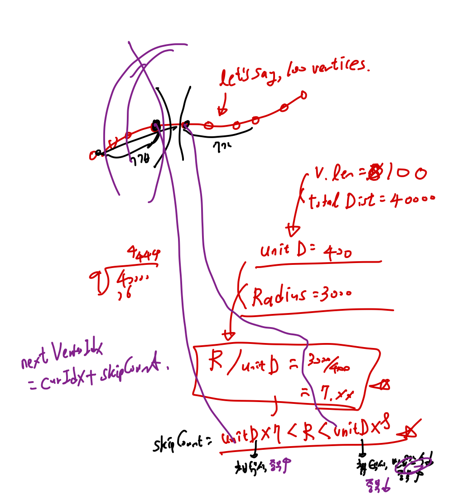

# OMW_BE

## Reference


## Prerequisites

`Node.js` = v18.16.1
If not installed, please install it using `nvm install 18.16.1`
This project uses `pnpm` as package manager. If not installed, please install it using `npm install -g pnpm`

## Automatic Node Version Switch

The repository contains `.nvmrc` file. By adding the script below to your bash configuration file (e.g.: `.zshrc`) it will automatically prompt nvm to switch to the required node version in given project.

```bash
# detect node version when navigating to projects that contain .nvmrc
cd() {
  builtin cd "$@"
  if [[ -f .nvmrc ]]; then
    nvm use
  fi
}
```

## BackEnd Repository for OnMyWay application

TBU

### Tech Stacks Used

`Nest.js` `TypeScript`
`ESLint` `Prettier`
`Jest` `Github Actions` `Git Flow` `pnpm`
`AWS Secrets Manager`

Grafana, Prometheus,
use MongoDB for monitoring/logging

Docker - ?
npmrc ?

Git Flow branching strategy, SourceTree for GUI
Utilize git tags for versioning

main - deploying to production, has tag for every release
develop - deploying to development,
feature/_ - new feature development
release/_ - deploying to staging
Hotfix/\* - bug fixes, merge directly to main


## Algorithm

TBU

Algorithm for choosing vertexes


### Prerequisites

- Node.js -> version?
- pnpm
- Nest.js installed
- typescript
  TBU

### Development

TBU


### Testing

TBU

### CI/CD
TBU

TBU

### Deployment

TBU
