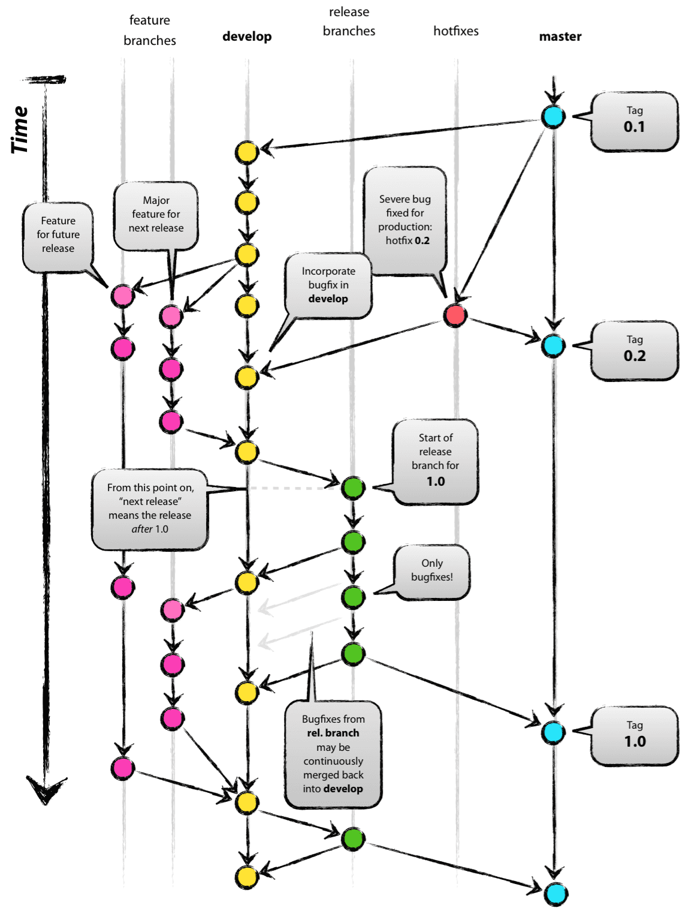

# OMW_BE

## BackEnd Repository for OnMyWay application

TBU

### Tech Stacks Used

`Nest.js` `TypeScript`
`ESLint` `Prettier`
`Jest` `Github Actions` `Git Flow` `pnpm`
`AWS Secrets Manager`

Grafana, Prometheus,
use MongoDB for monitoring/logging

Docker - ?
npmrc ?

Git Flow branching strategy, SourceTree for GUI
Utilize git tags for versioning

main - deploying to production, has tag for every release
develop - deploying to development,
feature/_ - new feature development
release/_ - deploying to staging
Hotfix/\* - bug fixes, merge directly to main

## Algorithm

TBU

Algorithm for choosing vertexes

### Prerequisites

- Node.js -> version?
- pnpm
- Nest.js installed
- typescript
  TBU

### Development

TBU

### Testing

TBU

### CI/CD

TBU

### Deployment

TBU
